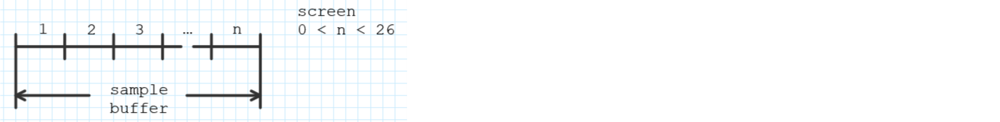

# DS212 Voltage Tracker
**Dual Channel Long Time Voltage Tracking**  
run times from 13 minutes up to 1 month  
(based on time bases from 0.1 seconds up to 3 minutes and 2 x 8 K sample buffer)

**General Operation**  
\- rotate top wheel to choose topic  
\- rotate side wheel to select value  
\- press side wheel for default value

## Prepare
\- press top wheel to toggle Status Line 1 / 2  
\- under 'Prepare' select 'Start'  
\- long press Start/Stop button to start/finish sampling

## Running / Stopped / Ready / Prepare
\- while 'Running or Stopped' short press Start/Stop button to interrupt/continue sampling  
\- voltage grid size is changed dynamically for offset and magnification  
\- time grid size is changed dynamically for number of screens and visible screen  
\- Status Line 1 is accessible in 'Prepare' mode only

## Buffer
\- 2 x 8 K sample buffer is divided to the number of screens selected with nScreen

## Remarks
Because I do not own an IAR Embedded Workbench license I cannot provide ready compiled executables here.  
Maybe an interested company, group or person could help, I think this works effort would justify it.

The project is based on the translated open sources V1.03 from kortschak (see links).  
Several parts of the original code were combed, reformatted, rewritten, expanded or discarded.  
VSCode and several extensions were used for editing, the diagrams are composed with OneNote.  
A big Thanks to kortschak for the translation.

The software is set up for 'Partition 2' installation.

No guarantee for proper operation can be given.

## Links
[http://www.miniware.com](http://www.miniware.com.cn/product/ds212-mini-oscilloscope-digital-oscilloscope)  
[http://www.minidso.com](http://www.minidso.com/forum.php?mod=viewthread&tid=1816)  
[https://github.com/kortschak](https://github.com/kortschak/ds212)  
[https://www.iar.com](https://www.iar.com/iar-embedded-workbench)  
[https://code.visualstudio.com](https://code.visualstudio.com)
